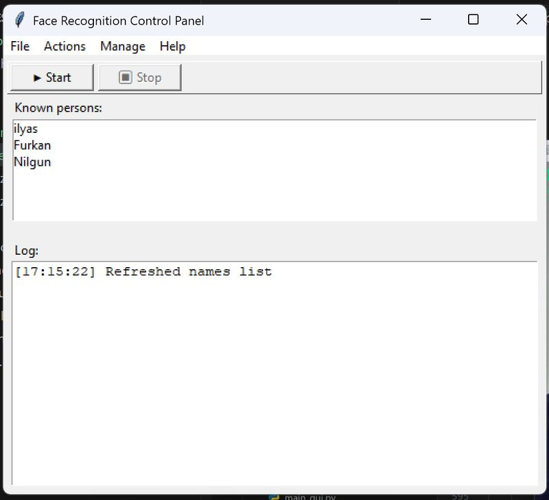
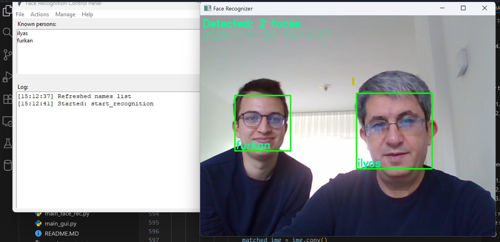

# Face Recognition (OpenCV + Tkinter) — Project Overview

This repository contains a small face recognition toolkit built with OpenCV (LBPH), Pillow and a lightweight Tkinter control panel. It provides utilities to record face samples, organize datasets, train an LBPH recognizer, and run live recognition with OpenCV preview windows. A simple Tkinter GUI is included to start/stop recognition and run other workflows.

## Highlights
- Record face images with stability/quality checks and guided capture
- Deterministic dataset organization and safe renaming (optional per-person subfolders)
- Robust trainer that skips unreadable files and handles nested dataset folders
- LBPH recognizer with simple smoothing across frames to reduce false positives
- Tkinter-based control panel (`main_gui.py`) that keeps the camera preview in OpenCV windows (no embedded video widget)
- Optional lightweight fallback VideoStream when `imutils` is not installed

## Requirements
- Python 3.7+ (tested on Windows; should work on Linux/Mac with minor camera backend differences)
- Recommended packages — install with:

PowerShell (recommended on Windows):

pip install -r requirements.txt

Notes:
- This project uses cv2.face (LBPHFaceRecognizer) which is provided by the opencv-contrib package. If recognition fails with an attribute error like `module 'cv2' has no attribute 'face'`, install the contrib package:

PowerShell:

pip install opencv-contrib-python

- `imutils` is optional. If it's not installed, the code uses a fallback based on OpenCV's VideoCapture.

## Quick start

1. Prepare the dataset folder (created automatically by the recorder):
- dataset/ — saved face images (files named like `id-name-index.jpg`)

2. Record face samples (GUI or CLI):
- GUI: Run `python main_gui.py` and use the toolbar/menu to record faces.
- CLI: Run `python main_face_rec.py` and choose the record option.

3. Train the recognizer:
- GUI: Use the Train action in the GUI or
- CLI: Use the Train option in `main_face_rec.py`.

This creates `recognizer/trainingData.yml`.

4. Start recognition:
- GUI: Use Start on the toolbar (Stop requests a cooperative shutdown).
- CLI: Choose the Recognize option in `main_face_rec.py`.

Recognized snapshots are saved (one per person) under `recognized/{name}.jpg` when the recognizer is sufficiently confident.

## Screenshot

Below is an example recognition snapshot produced by the app. Place the image file at `face_recognition_CV2/gitHubImages/face-reg2person.jpg` (or update the path below to match where you store it).

## Files and key modules

- `main_gui.py` — Tkinter control panel with menu and toolbar. Starts background threads for long-running tasks and communicates stop requests to the worker objects.
- `main_face_rec.py` — Command-line menu alternative to the GUI that exposes recording, training and recognition workflows.
- `scripts/face_recognition_classes.py` — Core library used by both GUI and CLI. Contains:
	- `FaceRecorder` — initialize camera (with retries), guided recording UI, stability and quality checks, saves 1..N samples per session.
	- `RecognizerTrainer` — collects dataset images (recursively), converts them to grayscale numpy arrays and trains LBPH recognizer, writes `recognizer/trainingData.yml`.
	- `FaceRecognizer` — loads trained recognizer and runs a live recognition loop with smoothing across frames and multi-face support. Supports cooperative stop via `request_stop()`.
	- `ImageDatasetOrganizer` — deterministic renamer and optional move-to-subfolders behavior; can also delete or rename people and refresh ID/name lists.
- `scripts/record_face.py`, `scripts/trainer.py`, `scripts/detector.py`, `scripts/create_database.py` — helper/legacy scripts for specific tasks (some functionality has been consolidated into `scripts/face_recognition_classes.py`).
- `haarcascade_frontalface_default.xml` — Haar cascade for face detection.
- `dataset/` — directory where captured face images are stored (created automatically).
- `recognizer/` — directory containing `trainingData.yml` produced by training.
- `recognized/` — saved recognition snapshots (one file per recognized person) when confidence is high.

## Dataset naming convention

Files are expected (and recorded) using the pattern:

id-name-index.jpg

Where `id` is a numeric identifier, `name` is the label (no spaces recommended), and `index` is the sample index (1..N). The organizer can move files into `dataset/{id}-{name}/` subfolders if requested.

## Tips & behavior notes

- Camera initialization: code attempts multiple retries and uses a DirectShow backend on Windows for better stability (if available).
- Recording: the recorder enforces a stability check (face position must be stable for several frames) and performs quality checks (size, brightness, contrast) before saving a sample.
- Training: the trainer only includes valid image files and skips directories and unreadable images (this resolves earlier PermissionErrors when dataset contains subfolders).
- Recognition stop semantics: recognition loops are cooperative. The GUI calls `request_stop()` on the running `FaceRecognizer` instance; the recognizer checks the flag on each iteration and exits gracefully. Pressing ESC in the OpenCV window also stops recognition immediately.
- Recognized images: saved to `recognized/{name}.jpg` when recognition confidence is high (the code uses a stricter threshold before saving to avoid false snapshots).

## Troubleshooting

- Error: `module 'cv2' has no attribute 'face'` — install opencv-contrib-python (contains cv2.face): `pip install opencv-contrib-python`.
- Camera not found / cannot read frame — ensure no other application is using the camera, grant camera permissions, and test with a simple OpenCV capture script. Try USB webcams on different ports if integrated camera fails.
- PermissionError while training — make sure dataset contains image files (not just directories). The trainer now scans recursively for files; if you still see errors, check file permissions.
- Low recognition accuracy — collect more diverse samples (different lighting, poses, expressions), increase `target_samples` when recording, and re-train.

## Development notes

- The repository includes a small fallback VideoStream class that uses OpenCV's VideoCapture when `imutils` is not installed. This keeps external dependencies small.
- The code intentionally keeps video preview in OpenCV windows rather than embedding the live view into the Tkinter GUI to keep the GUI lightweight and cross-platform.

## Running examples (PowerShell)

Start GUI:

python .\main_gui.py

Start CLI menu:

python .\main_face_rec.py

Record a person (CLI flow):

1) Run the CLI and choose Record
2) Enter numeric ID and a short name (no spaces recommended)
3) Follow on-screen instructions (stay in the green rectangle)

Train (CLI or GUI) and then Recognize.

## Contributing

If you'd like to contribute improvements (bug fixes, UI polish, packaging), please open a PR. Useful follow-ups:

- Add keyboard accelerators and PNG toolbar icons for better UX
- Add optional embedded video preview inside the Tkinter window (requires GUI work and threading care)
- Add unit tests for dataset organizer and trainer functions

## License

This README is provided as-is. The project itself does not include an explicit license file; add one (for example `LICENSE` with MIT) if you intend to open-source this project.

## Contact / Notes

If you want, I can also:
- generate a smaller QuickStart that you can print near your machine
- add sample screenshots for the GUI and OpenCV windows
- help package the app into a single executable with PyInstaller for Windows

Enjoy — and make sure to collect high-quality face samples for best recognition results.

